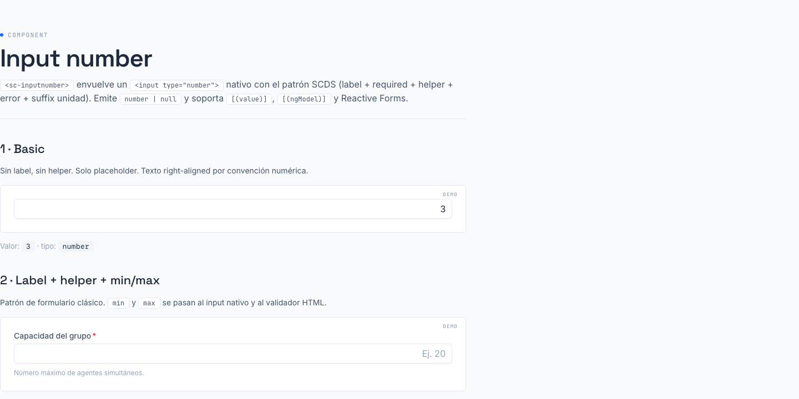

# 03 · Input number (`<sc-inputnumber>`)



> **Type**: Extended · **AED uses**: 7 · **Figma parity**: 1:1 con Figma

> Numeric input para formularios SC. Misma chrome que `<sc-inputtext>` pero con valor tipado `number | null`, sufijo de unidad opcional y texto right-aligned. Cubre los casos de contadores, capacidades, segundos, porcentajes.

## TL;DR

```html
<sc-inputnumber
  label="Capacidad del grupo"
  placeholder="Ej. 20"
  suffix="agentes"
  helperText="Número máximo de agentes simultáneos."
  [min]="1"
  [max]="200"
  [required]="true"
  [(value)]="capacity"
/>
```

## Cuándo usarlo

- Campos numéricos enteros o decimales: contadores, capacidades, segundos, porcentajes, valores de configuración.
- Reemplaza el patrón `<input type="number" class="field__input--num">` repetido en AED.

## Cuándo NO usarlo

- Para texto, email, etc. → `<sc-inputtext>`.
- Para currency con formato local (`1.234,56 €`) → `<p-inputNumber>` directo (Custom-preset, TBD). `sc-inputnumber` deliberadamente NO incluye formatting/locale porque AED no lo usa hoy.
- Para spinner buttons (+/−) → `<p-inputNumber>` directo. Misma razón.
- Para sliders / rangos → `<sc-slider>` (TBD).

## API

```typescript
interface ScInputNumberProps {
  // Chrome (mirrors sc-inputtext)
  size?: 'sm' | 'md' | 'lg';   // default 'md'
  label?: string;
  required?: boolean;
  helperText?: string;
  error?: string;               // overrides helperText, pinta borde rojo
  placeholder?: string;
  disabled?: boolean;
  readonly?: boolean;
  inputId?: string;             // auto: 'sc-inputnumber-N'
  name?: string;

  // Number-specific
  min?: number;
  max?: number;
  step?: number;                // default 1 — incremento con flechas ↑/↓
  suffix?: string;              // unidad: 's', 'min', '%', 'agentes'

  // Two-way binding (cualquiera funciona)
  value?: number | null;        // model() — null cuando el campo está vacío
  // o ngModel via ControlValueAccessor
  // o formControl via ReactiveForms
}
```

## Bindings soportados

### Signals (recomendado)

```html
<sc-inputnumber [(value)]="capacitySignal" />
```

```typescript
capacitySignal = signal<number | null>(null);
```

### ngModel

```html
<sc-inputnumber [(ngModel)]="capacity" />
```

### Reactive Forms

```html
<sc-inputnumber
  [formControl]="agentsCtrl"
  [min]="1"
  [max]="50"
  [error]="agentsCtrl.touched && agentsCtrl.invalid
    ? (agentsCtrl.errors?.['required'] ? 'Requerido.'
      : agentsCtrl.errors?.['min'] ? 'Mínimo 1.'
      : agentsCtrl.errors?.['max'] ? 'Máximo 50.'
      : 'Inválido.')
    : undefined"
/>
```

```typescript
agentsCtrl = new FormControl<number | null>(null, [
  Validators.required, Validators.min(1), Validators.max(50),
]);
```

## Estados visuales

| Estado | Trigger | Visual |
|--------|---------|--------|
| Default | — | border default, texto right-aligned |
| Hover | mouseover | border strong |
| Focus | tab / click | border primary, focus ring |
| Disabled | `[disabled]="true"` | bg disabled, suffix dim |
| Readonly | `[readonly]="true"` | sin cursor de edición |
| Error | `[error]="..."` | border danger, mensaje + suffix en rojo |

## Tokens consumidos

Hereda de `sc-preset.ts → semantic.formField.*` (border, radius, padding, focus ring) y de `--sc-color-gray-*` (text colors).

Específicos del componente:
- `--sc-spacing-0-25` — gap label/input/helper
- `--sc-spacing-0-875` — padding horizontal interno
- `--sc-font-size-100/200/300` — escala suffix por size
- `--sc-text-subtle` — color suffix
- `--sc-text-danger` — color error

## Divergencias documentadas

- **Texto right-aligned por defecto**. Convención numérica (alineas decimales, columnas). Si necesitas left-align para un caso concreto (p.ej. ID/código), override con CSS local. NO añadir prop `[align]` hasta que tengamos 2+ casos reales.
- **Spinners nativos ocultos**. Los browser defaults (`::-webkit-inner-spin-button`) son inconsistentes y feos. AED no los usa. Reactivar requiere refactor.
- **No locale formatting**. `1234` se muestra como `1234`, no `1.234`. PrimeNG `p-inputNumber` lo hace; deliberadamente fuera de scope aquí. Si llega un caso real, escalar a `p-inputNumber` Custom-preset.
- **Padding-right del suffix se calcula automáticamente** según `suffix().length` (Inter ≈ 0.6em por carácter + 0.5em safety, mínimo 2.3em para preservar suffixes cortos). Se expone como CSS custom property `--sc-inputnumber-suffix-pad` en el host. Si el cálculo falla por una fuente custom, override la variable en el consumer.

## Comparativa con `<sc-inputtext>`

| Aspecto | `<sc-inputtext>` | `<sc-inputnumber>` |
|---------|--------------|---------------------|
| Tipo de valor | `string` | `number \| null` |
| Alineación texto | left | right |
| Slots extra | leftIcon, rightIcon | suffix (texto) |
| HTML input type | text/email/password/tel/url/search | number |
| Validación tipo | regex / Validators | Validators.min/max + browser min/max |
| inputmode | (heredado del type) | numeric |
| Spinners nativos | n/a | ocultos |

## Migración desde `<input type="number">` en AED

**Antes**:
```html
<div class="field">
  <label class="field__label" for="capacity">Capacidad</label>
  <input
    id="capacity"
    type="number"
    min="0"
    class="field__input"
    [value]="form().capacityValue"
    (input)="onTextInput('capacityValue', $event)"
  />
  <span class="field__help">Capacidad opcional del grupo.</span>
</div>
```

**Después**:
```html
<sc-inputnumber
  label="Capacidad"
  helperText="Capacidad opcional del grupo."
  [min]="0"
  [(value)]="form().capacityValue"
/>
```

Si la pareja `[value] + (input)` desserializaba un string a number a mano, ya no hace falta — `<sc-inputnumber>` emite `number | null` directamente.

## Recipe: porcentaje 0–100

```html
<sc-inputnumber
  label="Umbral de alerta"
  suffix="%"
  [min]="0"
  [max]="100"
  [step]="5"
  [(value)]="thresholdSignal"
/>
```

## Recipe: segundos con default

```html
<sc-inputnumber
  label="Pausa standard"
  suffix="s"
  [min]="0"
  [(value)]="pausaStandardSignal"
/>
```

## Página demo

`apps/ds-docs/src/app/pages/input-number/input-number-gallery.component.html` → ruta `/components/input-number` en ds-docs.

## Figma reference

TBD — pendiente node-id del Smart Contact Prime UI Kit. Cuando aparezca, anotar aquí y en `MIGRATION-INVENTORY.md`.
