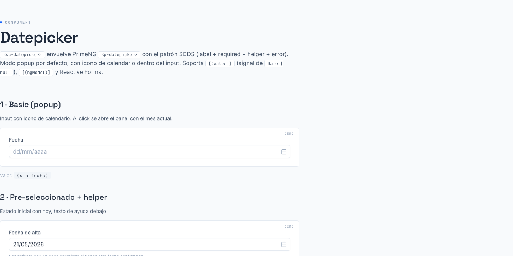

# 05 · Datepicker (`<sc-datepicker>`)



> **Type**: Extended · **AED uses**: 0 · **Figma parity**: 1:1 con Figma

> Date picker para formularios SC. Envuelve PrimeNG `<p-datepicker>` con la chrome SCDS. Single-date selection en popup por defecto; soporta inline, mes-only, año-only y bounds min/max.

## TL;DR

```html
<sc-datepicker
  label="Fecha de alta"
  helperText="Cuándo empieza el agente."
  [(value)]="hireDate"
/>
```

## Cuándo usarlo

- Selección de UNA fecha en formulario: alta/baja, próxima cita, vencimiento.
- Bounded ranges (próximos 30 días, no antes de hoy, etc.) → `[minDate]` / `[maxDate]`.
- Filtros por mes o año → `view="month"` / `view="year"`.
- Inline en wizards o screens dedicadas → `[inline]="true"`.

## Cuándo NO usarlo

- Para rangos de fechas (desde/hasta) → `<sc-date-range>` (TBD).
- Para hora-only → `<sc-time-picker>` (TBD).
- Para timestamp con hora → habilitar `[showTime]` (TBD, no implementado en v1).
- Para fechas relativas ("últimos 7 días") → `<sc-select>` con opciones predefinidas.

## API

```typescript
interface ScDatepickerProps {
  // Chrome (mirrors sc-inputtext)
  size?: 'sm' | 'md' | 'lg';   // default 'md'
  label?: string;
  required?: boolean;
  helperText?: string;
  error?: string;
  placeholder?: string;         // default 'dd/mm/aaaa'
  disabled?: boolean;
  inputId?: string;             // auto 'sc-datepicker-N'
  name?: string;

  // Date-specific
  dateFormat?: string;          // default 'dd/mm/yy' (es-ES)
  view?: 'date' | 'month' | 'year';  // default 'date'
  minDate?: Date;
  maxDate?: Date;
  inline?: boolean;             // panel siempre visible
  showClear?: boolean;          // "×" en el input
  showIcon?: boolean;           // calendar icon (default true, popup only)
  showButtonBar?: boolean;      // "Hoy" / "Limpiar" en el footer del panel

  // Two-way binding
  value?: Date | null;          // model() — null cuando vacío
  // o ngModel via ControlValueAccessor
  // o formControl via ReactiveForms
}
```

## Estados visuales (de Figma)

| Estado | Visual |
|--------|--------|
| Idle (input cerrado) | mismo chrome que sc-inputtext/sc-select: slate-300 border, 6px radius, drop shadow `#1212170D` |
| Focus (panel abierto) | border azul, panel con shadow doble debajo |
| Disabled | opacidad 60% |
| Invalid | border danger (mismo que sc-inputtext/sc-select) |

## Panel (calendario popup)

| Elemento | Spec |
|----------|------|
| Background | white |
| Border | slate-200 (`#e2e8f0`) |
| Padding | 10.5px |
| Anchor gutter | 2px (gap entre input y panel) |
| Shadow | doble layer: `#0000001A` offset(0,2) r4 -2 + `#0000001A` offset(0,4) r6 -1 |
| Header bg | white, border-bottom slate-200, padding-bottom 7 |
| Title (mes/año) | slate-700, font-weight 500, gap 7 |
| Week day labels | slate-700, 500, padding 3.5 |
| Dates | 28×28, border-radius 14 (= circular), color slate-700, padding 3.5 |
| Today | accent ring (preset) |
| Selected | bg primary, color white |
| Disabled days | opacity 60%, no click |
| Button bar | border-top slate-200, padding-top 7 |

## Tokens consumidos (Figma → SC) — matriz exhaustiva por variant

Todas las medidas verificadas vía `mcp__claude_ai_Figma__get_variable_defs` en cada nodo del page `❖ Datepicker` (canvas raíz, frame `Components` `6738:20817`).

### Input chrome (igual para todos los picker types)

Nodos verificados: `109:12493` (Idle Default), `128:4810` (Idle Month), `130:5803` (Idle Year), `127:5961` (Idle Time).

| Token Figma | Valor | Mapeo SC |
|-------------|-------|----------|
| `inputtext/padding/x` | `10.5` | `--p-inputtext-padding-x` ← inherita sc-preset |
| `inputtext/padding/y` | `7` | `--p-inputtext-padding-y` |
| `inputtext/border/radius` | `6` | `--p-inputtext-border-radius` ← `--sc-radius-200` |
| `inputtext/background` | `#ffffff` | `--p-inputtext-background` ← `--sc-color-gray-0` |
| `inputtext/border/color` | `#cbd5e1` | `--p-inputtext-border-color` ← `--sc-color-gray-300` (Aura slate) |
| `inputtext/focus/border/color` | `#3b82f6` | `--p-inputtext-focus-border-color` ← `--sc-color-azure-500` |
| `inputtext/shadow` | drop-shadow `#1212170D` offset(0,1) r2 | `--p-inputtext-shadow` |

Idéntico a sc-inputtext/sc-select. Reuso 100% del bridge `--p-inputtext-*`.

### Panel (común a todos los picker types)

| Token Figma | Valor | Notas |
|-------------|-------|-------|
| `datepicker/panel/background` | `#ffffff` | bg blanco |
| `datepicker/panel/border/color` | `#e2e8f0` | slate-200 |
| `datepicker/panel/border/radius` | `6` | mismo que input |
| `datepicker/panel/padding` | `10.5` | inset uniforme |
| `datepicker/panel/shadow` | `#0000001A` offset(0,2)r4 -2 + `#0000001A` offset(0,4)r6 -1 | doble layer |
| `anchor/gutter` | `2` | gap input ↔ panel |

### Header del panel

| Token Figma | Valor |
|-------------|-------|
| `datepicker/header/background` | `#ffffff` |
| `datepicker/header/border/color` | `#e2e8f0` |
| `datepicker/header/padding/{l,t,r}` | `0` |
| `datepicker/header/padding/bottom` | `7` (separación al body del calendario) |
| `datepicker/title/font/weight` | `500` |
| `datepicker/title/gap` | `7` (gap mes ↔ año) |

### Picker Type = Default (Day picker, node `109:12493` / `94:1828`)

| Token Figma | Valor | Notas |
|-------------|-------|-------|
| `datepicker/select/month/color` | `#334155` (slate-700) | botón cabecera |
| `datepicker/select/month/padding/x` | `7` | |
| `datepicker/select/month/padding/y` | `3.5` | |
| `datepicker/select/month/border/radius` | `6` | |
| `datepicker/select/year/{color,padding,radius}` | idem month | |
| `datepicker/week/day/color` | `#334155` (slate-700) | encabezados L M X J V S D |
| `datepicker/week/day/font/weight` | `500` | |
| `datepicker/week/day/padding` | `3.5` | |
| `datepicker/date/color` | `#334155` | día sin estado |
| `datepicker/date/width` × `height` | `28 × 28` | celda |
| `datepicker/date/border/radius` | `14` | **circular** (=width/2) |
| `datepicker/date/padding` | `3.5` | |
| `datepicker/day/view/margin/top` | `7` | gap header ↔ semana |

### Picker Type = Month (node `128:4810` / `128:5032`)

| Token Figma | Valor |
|-------------|-------|
| `datepicker/month/padding` | `5.25` |
| `datepicker/month/border/radius` | `6` |
| `datepicker/month/view/margin/top` | `7` |
| (cabecera reutiliza `select/year` only) | |

### Picker Type = Year (node `130:5803` / `130:6025`)

| Token Figma | Valor |
|-------------|-------|
| `datepicker/year/padding` | `5.25` |
| `datepicker/year/border/radius` | `6` |
| `datepicker/year/view/margin/top` | `7` |

### Picker Type = Time (node `127:5961` / `127:6183`)

| Token Figma | Valor |
|-------------|-------|
| `datepicker/panel/color` | `#334155` (texto numeros) |
| `datepicker/time/picker/gap` | `7` (entre HH : MM) |
| `datepicker/time/picker/button/gap` | `3.5` (entre ▲/▼) |
| `datepicker/time/picker/border/color` | `#e2e8f0` |
| (No usa `week/day`, `date/*`) | |

### Botones interiores (header, button bar)

| Token Figma | Valor |
|-------------|-------|
| `button/text/secondary/color` | `#64748b` (slate-500) |
| `button/padding/y` | `7` |
| `button/padding/x` | `10.5` |
| `button/gap` | `7` |
| `button/border/radius` | `6` |
| `button/icon/only/width` | `35` |
| `button/rounded/border/radius` | `28` (chevrons ◄ ►) |
| `button/label/font/weight` | `500` |

### Button bar (footer del panel, opt-in vía `[showButtonBar]`)

| Token Figma | Valor |
|-------------|-------|
| `datepicker/buttonbar/border/color` | `#e2e8f0` (top divider) |
| `datepicker/buttonbar/padding/top` | `7` |
| `datepicker/buttonbar/padding/{l,r,b}` | `0` |

### Estados

| Estado | Token | Valor |
|--------|-------|-------|
| Disabled | `disabled/opacity` | `60%` (global, no específico) |
| Invalid | (no hay invariante propia — usa input border-error de sc-preset) | |
| Hover | (no hay variant Figma — sc-preset aplica slate-400 vía CSS hover) | |

## Divergencias documentadas

- **Sizes sm / md / lg**: añadidos por consistencia con `sc-inputtext` / `sc-select`. **NO existen en Figma** — el Figma solo modela densidad Normal. Las clases `--sm / --lg` modulan font-size + padding-y vía sc-preset (mismo escalado que sc-inputtext). Si en algún momento el equipo de diseño define densidades específicas, ajustar.
- **Hover state**: no es un variant Figma separado; preset CSS lo pinta a `slate-400` border. Mismo patrón que sc-inputtext/sc-select.
- **Invalid state**: no es variant Figma; preset pinta `--sc-border-error` cuando hay `aria-invalid`. Activado por `[error]` o por FormControl invalid+touched.
- **Inline Time / Inline Month / Inline Year**: el componente acepta `[view]="month"|"year"` pero NO expone time-picker en v1 (`[showTime]` no implementado). Cuando llegue caso real, las medidas ya están extraídas arriba — solo flag toggle.

## Migración desde `<input type="date">` o picker propio

**Antes**:

```html
<div class="field">
  <label class="field__label" for="hire-date">Fecha de alta</label>
  <input id="hire-date" type="date" class="field__input"
         [value]="form().hireDate"
         (change)="onHireDate($event)" />
  <span class="field__help">Cuándo empieza el agente.</span>
</div>
```

**Después**:

```html
<sc-datepicker
  label="Fecha de alta"
  helperText="Cuándo empieza el agente."
  [(value)]="form().hireDate"
/>
```

El binding emite `Date | null`. Si tu form guarda strings ISO (`'2026-05-15'`), conviértelo en el setter del store.

## Recipe: bounded range (futuro)

```html
<sc-datepicker
  label="Próxima cita"
  [minDate]="today"
  [maxDate]="thirtyDaysFromNow"
  [(value)]="appointmentDate"
/>
```

```typescript
today = new Date();
thirtyDaysFromNow = new Date(Date.now() + 30 * 86400000);
```

## Recipe: mes-only para informes

```html
<sc-datepicker
  label="Mes del informe"
  view="month"
  dateFormat="mm/yy"
  placeholder="mm/aaaa"
  [(value)]="reportMonth"
/>
```

## Página demo

`apps/ds-docs/src/app/pages/datepicker/datepicker-gallery.component.html` → ruta `/components/datepicker`.

## Figma reference

`Smart Contact Prime → ❖ Datepicker` (node `6738:20817`). Frame `Components` con matriz `Type` (Popup/Inline) × `State` (Idle/Focus) × `Picker Type` (Default/Month/Year/Time).
