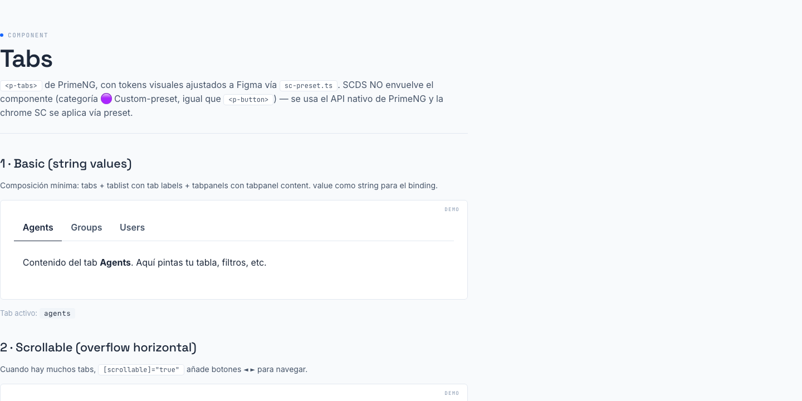

# 06 · Tabs (`<p-tabs>`)



> **Type**: Custom-preset · **AED uses**: 0 · **Figma parity**: 1:1 con Figma

> Navegación tabular para organizar contenido en secciones. SCDS NO envuelve PrimeNG aquí — usa `<p-tabs>` directo con overrides en `sc-preset.ts`. Categoría 🟣 **Custom-preset** (mismo patrón que `<p-button>`).
>
> **Auditado 1:1 con Figma `Smart Contact Prime → ❖ Tabs` (canvas `6738:49740`) — Session 30.** Variants: tab × (Idle / Hover / Highlight) + tabpanels × (Focus False / True).

## TL;DR

```html
<p-tabs [(value)]="activeTab">
  <p-tablist>
    <p-tab value="agents">Agents</p-tab>
    <p-tab value="groups">Groups</p-tab>
    <p-tab value="users">Users</p-tab>
  </p-tablist>
  <p-tabpanels>
    <p-tabpanel value="agents">…</p-tabpanel>
    <p-tabpanel value="groups">…</p-tabpanel>
    <p-tabpanel value="users">…</p-tabpanel>
  </p-tabpanels>
</p-tabs>
```

Importar:

```typescript
import { TabsModule } from 'primeng/tabs';
```

## Cuándo usarlo

- Sub-secciones dentro de UNA pantalla (no usar tabs para navegación entre rutas — usar router + sidebar).
- Filtros de vista mutuamente excluyentes (Activos / Archivados / Todos).
- Forms divididos en pasos (consider también wizards).

## Cuándo NO usarlo

- Navegación entre páginas → usar `<a routerLink>` o sidebar.
- Más de 6-7 tabs → considerar dropdown o segmented control + filtros.
- Tabs verticales → usar otro componente (TBD).

## Tokens Figma — matriz por variant

Verificados vía MCP en cada variant del Figma `Smart Contact Prime → ❖ Tabs`.

### Tab Idle — node `3358:29419`

| Token Figma | Valor | Mapeo SC |
|-------------|-------|----------|
| `tabs/tab/color` | `#64748b` (slate-500) | Aura `text.muted.color` → `--sc-text-subtle` ✓ |
| `tabs/tab/background` | transparent | Aura default ✓ |
| `tabs/tab/border/color` | `#e2e8f0` (slate-200) | Aura `content.border.color` ✓ |
| `tabs/tab/padding/x` | `15.75` | **override en preset** (Aura default 1.125rem = 18) |
| `tabs/tab/padding/y` | `14` | **override en preset** (Aura default 1rem = 16) |
| `tabs/tab/gap` | `7` | **override en preset** (Aura default 0.5rem = 8) |

### Tab Hover — node `320:12256`

| Token Figma | Valor | Mapeo SC |
|-------------|-------|----------|
| `tabs/tab/hover/color` | `#334155` (slate-700) | Aura `text.color` ✓ |
| (background, border) | sin cambio | ✓ |

### Tab Active / Highlight — node `320:12265`

| Token Figma | Valor | Mapeo SC |
|-------------|-------|----------|
| `tabs/tab/active/color` | `#3b82f6` (azure) | Aura `primary.color` → **SC navy `--sc-bg-primary`** |
| `tabs/tab/active/border/color` | `#3b82f6` | Aura `primary.color` → **SC navy** |
| `tabs/tab/active/background` | transparent | Aura default ✓ |

### Tabs container — node `320:12276`

| Token Figma | Valor | Mapeo SC |
|-------------|-------|----------|
| `tabs/tablist/background` | `#ffffff` | Aura `content.background` → `--sc-bg-surface` ✓ |
| `tabs/tablist/border/color` | `#e2e8f0` | Aura `content.border.color` ✓ |

### Tabpanel (Focus=True) — node `6555:1639`

| Token Figma | Valor | Mapeo SC |
|-------------|-------|----------|
| `tabs/tabpanel/background` | `#ffffff` | Aura `content.background` ✓ |
| `tabs/tabpanel/color` | `#334155` (slate-700) | Aura `content.color` ✓ |
| `tabs/tabpanel/padding/top` | `12.25` | **override en preset** (Aura 0.875rem = 14) |
| `tabs/tabpanel/padding/right/bottom/left` | `15.75` | **override en preset** (Aura 1.125rem = 18) |
| `tabs/tabpanel/focus/ring/color` | `#3b82f6` (azure) | Aura inherits `focus.ring.color` → preset `--sc-color-electric-blue-500` ✓ |
| `tabs/tabpanel/focus/ring/offset` | `2` | preset focusRing.offset ✓ |

## Brand divergences

- **Tab active color**: Figma azure `#3b82f6` → SC navy `--sc-bg-primary`. Heredado de `semantic.primary` (= `--sc-color-blue-500`). Mismo patrón documentado en `<p-button>` severity=primary. La indicación visual del tab activo respeta la primary de marca.
- **Tab active border color**: idem (azure → navy). El underline del tab activo es navy.

## Overrides en sc-preset.ts

Añadidos en Session 30 dentro del bloque `components.tabs`:

```ts
tabs: {
  tab: {
    padding: '14px 15.75px',  // Y X (Figma)
    gap: '7px',
  },
  tabpanel: {
    padding: '12.25px 15.75px 15.75px 15.75px',
  },
}
```

Color tokens inherit Aura → semantic.primary → navy (intentional).

## Variant `scrollable`

PrimeNG p-tabs soporta `[scrollable]="true"` que añade botones nav ◄ ► cuando los tabs no caben. Figma no modela este caso (probablemente upstream Aura). Usar libre.

## Accesibilidad

- Cada `<p-tab>` renderiza un `<button role="tab">` con `aria-selected` y `aria-controls`.
- Tab activo se navega con flechas izquierda/derecha (PrimeNG nativo).
- Focus visible en el tabpanel (focus ring electric-blue + offset 2 — preset).

## Página demo

`apps/ds-docs/src/app/pages/tabs/tabs-gallery.component.html` → ruta `/components/tabs`.

## Figma reference

`Smart Contact Prime → ❖ Tabs` (canvas `6738:49740`). Estructura:
- `Parts` (`6872:71953`) — variants tab + tabpanels
- `Components` (`6872:71955`) — showcase
- `Examples` (`6872:71957`) — light + dark mode
