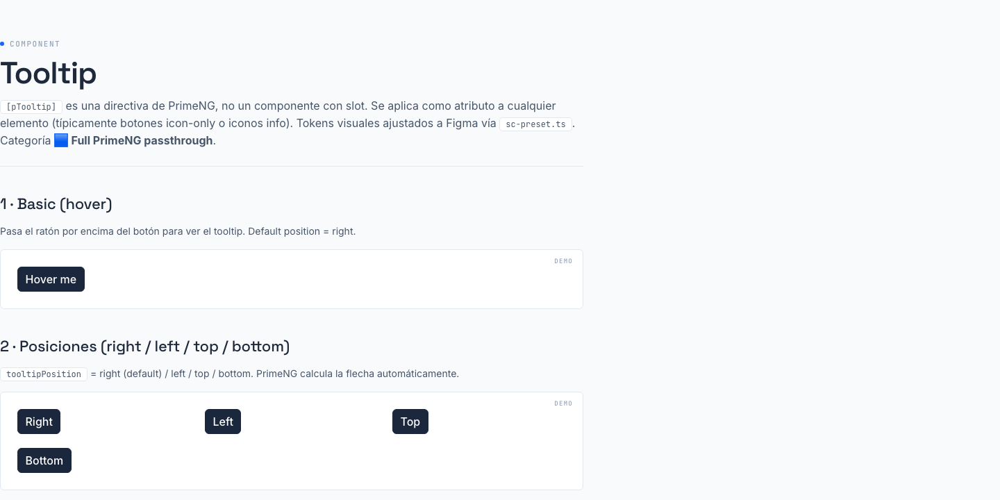

# 07 · Tooltip (`[pTooltip]`)



> **Type**: Full PrimeNG · **AED uses**: 0 · **Figma parity**: 1:1 con Figma

> Directiva de PrimeNG para mostrar hint text al hover. SCDS NO envuelve PrimeNG aquí — se usa la directiva nativa con overrides en `sc-preset.ts`. Categoría 🟦 **Full PrimeNG passthrough**.
>
> **Auditado 1:1 con Figma `Smart Contact Prime → ❖ Tooltip` (canvas `6738:50212`) — Session 30.** Variants: Direction × (Right / Left / Down / Up) + Tooltip × (False / True).

## TL;DR

```html
<p-button label="Hover me" pTooltip="Soy un tooltip" tooltipPosition="top" />
<i class="pi pi-info-circle" pTooltip="Más info"></i>
```

Importar:

```typescript
import { TooltipModule } from 'primeng/tooltip';
```

## Cuándo usarlo

- Botones icon-only (REQUIERE — sino sin accesibilidad).
- Iconos info (ℹ️) junto a labels que necesitan ayuda contextual.
- Truncar textos largos con tooltip mostrando texto completo.
- Hint adicional sobre un control complejo.

## Cuándo NO usarlo

- Para texto crítico (errores, validaciones) → usar mensajes visibles, NO ocultos en hover.
- Para mobile (sin hover) → considerar otro patrón (popover, expandable, etc.).
- Para texto que el usuario debe leer obligatoriamente → label visible.

## API (directiva)

| Atributo | Tipo | Default | Notas |
|----------|------|---------|-------|
| `pTooltip` | `string` | - | El texto del tooltip |
| `tooltipPosition` | `'right' \| 'left' \| 'top' \| 'bottom'` | `'right'` | Posición relativa al elemento |
| `tooltipEvent` | `'hover' \| 'focus'` | `'hover'` | Trigger event |
| `showDelay` | `number` | `0` | ms antes de mostrar |
| `hideDelay` | `number` | `0` | ms antes de ocultar |
| `tooltipDisabled` | `boolean` | `false` | Desactivar el tooltip condicionalmente |
| `tooltipStyleClass` | `string` | - | Clase CSS extra al panel |

## Tokens Figma — matriz por variant

Verificados vía MCP en cada Direction variant del Figma.

### Tooltip base — node `623:36925` (Direction=Right)

| Token Figma | Valor | Mapeo SC |
|-------------|-------|----------|
| `tooltip/background` | `#334155` (slate-700) | preset `components.tooltip.root.background = --sc-color-gray-700` |
| `tooltip/color` | `#ffffff` | preset `--sc-color-gray-0` |
| `tooltip/padding/x` | `10.5` | preset `padding: '7px 10.5px'` (Y X) |
| `tooltip/padding/y` | `7` | idem |
| `tooltip/border/radius` | `6` | preset `--sc-radius-200` |
| `tooltip/max/width` | `175` | preset `maxWidth: '175px'` |
| `tooltip/shadow` | `#0000001A` offset(0,2)r4-2 + offset(0,4)r6-1 | hereda preset overlay.popover (mismo shadow que datepicker panel) |

### Direction variants

Los 4 valores (Right / Left / Down / Up) NO cambian colores ni padding — solo la posición de la flecha (arrow):
- node `623:36925` Direction=Right (arrow apunta a la izquierda, panel a la derecha)
- node `623:36927` Direction=Left
- node `623:36937` Direction=Down (panel arriba, arrow apunta abajo)
- node `623:36942` Direction=Up (panel abajo, arrow apunta arriba)

PrimeNG calcula la flecha automáticamente según `tooltipPosition`. Mapping:
- `tooltipPosition="right"` → Figma Direction=Right ✓
- `tooltipPosition="left"` → Figma Direction=Left ✓
- `tooltipPosition="top"` → Figma Direction=Up ✓
- `tooltipPosition="bottom"` → Figma Direction=Down ✓

## Estados (Tooltip = False / True)

Figma modela "tooltip visible vs no visible" como axis (False/True). En código no hay estado — el tooltip aparece on-hover y se oculta on-leave. La distinción Figma es para visualizar AMBOS estados en el design file.

## Overrides en sc-preset.ts

Añadidos en Session 30 dentro del bloque `components.tooltip`:

```ts
tooltip: {
  root: {
    background: 'var(--sc-color-gray-700)',  // slate-700
    color: 'var(--sc-color-gray-0)',         // white
    padding: '7px 10.5px',                   // Y X (raw Figma)
    borderRadius: 'var(--sc-radius-200)',    // 6px
    maxWidth: '175px',                       // Figma cap
  },
}
```

Shadow se hereda automáticamente del `overlay.popover.shadow` (mismo `--sc-shadow-popover` que datepicker panel). No requiere override.

## Brand divergences

- **Ninguna**. El tooltip usa slate-700 puro en Figma y SC lo respeta literalmente.

## Accesibilidad

- PrimeNG asigna automáticamente `aria-describedby` al elemento que tiene `[pTooltip]`.
- En botones icon-only sin label, el tooltip text se usa también como aria-label (regla nativa PrimeNG).
- El tooltip aparece on `focus` (no solo hover) — accesible para keyboard nav.
- Respeta `prefers-reduced-motion`: sin animación de entrada/salida.

## Página demo

`apps/ds-docs/src/app/pages/tooltip/tooltip-gallery.component.html` → ruta `/components/tooltip`.

## Figma reference

`Smart Contact Prime → ❖ Tooltip` (canvas `6738:50212`). Estructura:
- `Parts` (`6872:72191`) — 4 direction variants
- `Components` (`6872:72193`) — 8 cells (visible × position)
- `Examples` (`6872:72195`) — light + dark mode con cada posición
