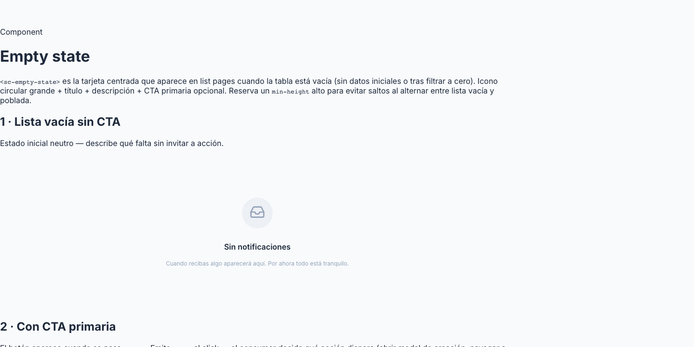

# 12 · Empty State (`<sc-empty-state>`)



> **Type**: Pure SC · **AED uses**: 3 · **Figma parity**: Sin Figma equivalente

> Componente para mostrar "vacío amable" cuando una lista no tiene rows (initial seed, sin resultados de filtro, sin datos del backend).
>
> Categoría ⚪ **Pure SC** — patrón app-specific de AED, NO existe en el Smart Contact Prime kit ni en PrimeOne/Aura. Diseñado in-house siguiendo convenciones de listas vacías (Linear, Stripe, Notion).

## TL;DR

```html
<sc-empty-state
  [icon]="usersIcon"
  titleKey="agents.empty.title"
  bodyKey="agents.empty.body"
  ctaKey="agents.empty.cta"
  (cta)="onCreateAgent()"
/>
```

## Cuándo usarlo

- Lista (tabla, grid, sidebar) que tiene 0 rows tras `ngOnInit`.
- Después de un filtro/búsqueda que vacía la vista (`filter applied, no results`).
- Pantalla de bienvenida a una feature no usada (onboarding suave).
- Estado intermedio "todavía sin datos" en una sección de configuración.

## Cuándo NO usarlo

- Para errores de carga → componente de error (TBD) con retry.
- Para skeleton/loading → patrón skeleton inline.
- Para mensajes inline cortos ("0 items") → solo texto, sin componente dedicado.

## Anatomía

```
            ┌─────────────┐
            │  ◯ (icon)   │   ← círculo subtle 64px con icono 32px dentro
            └─────────────┘

            Sin agentes              ← title (16px, semibold)

       Crea tu primer agente para     ← body (descriptive paragraph)
        empezar a recibir mensajes.

          [+ Crear agente]            ← optional primary CTA button
```

Layout vertical, centered, con `min-height: 320px` para que el header de la página NO se mueva cuando la lista pasa de vacía → con datos (no-CLS).

## API

```typescript
interface ScEmptyStateProps {
  icon: LucideIcon;                  // requerido — Lucide icon imported from 'lucide-angular'
  titleKey: string;                  // requerido — clave i18n del título
  bodyKey: string;                   // requerido — clave i18n del cuerpo descriptivo
  ctaKey?: string | null;            // opcional — clave i18n del botón CTA (si null, no se renderiza)
  // Output
  cta: () => void;                   // emitido al click del CTA
}
```

## Tokens consumidos

| Token | Uso |
|-------|-----|
| `--sc-spacing-300` | gap entre icon / title / body / CTA |
| `--sc-spacing-200` | margin-bottom adicional bajo el icono |
| `--sc-spacing-600` | padding vertical del wrapper |
| `--sc-spacing-400` | padding horizontal del wrapper |
| `--sc-bg-subtle` | fondo del círculo del icono |
| `--sc-text-subtle` | color del icono dentro del círculo |
| `--sc-text-primary` | color del title |
| `--sc-text-secondary` | color del body |
| `--sc-font-size-300` (16px) | title |
| `--sc-font-size-200` (14px) | body |
| `min-height: 320px` | reserva de espacio (no-CLS) |
| `width / height: 64px` icon container | círculo (`border-radius: 9999px`) |
| Icon size 32px | glyph dentro del círculo |

CTA usa las mismas tokens que un `<p-button>` con severity primary (preset).

## Estados visuales

| Estado | Trigger | Visual |
|--------|---------|--------|
| Default | sin CTA | icon + title + body, centered |
| Con CTA | `[ctaKey]` set | añade botón primary debajo del body |

No hay variantes Sm/Lg ni Filled — el componente es de un tamaño fijo para mantener consistencia entre listas.

## Accesibilidad

- `role="status"` + `aria-live="polite"` en el wrapper — screen readers anuncian el cambio cuando la lista pasa a vacía.
- El icono tiene `aria-hidden="true"` (es decorativo, el title transmite el mensaje).
- El CTA es un `<button type="button">` real con texto i18n.

## Decisiones de diseño SC

- **Círculo grande para el icono** (64px container, 32px glyph): da peso visual sin requerir ilustración. Patrón Linear / Stripe.
- **Sin ilustración custom**: AED prefiere consistencia entre features (mismo "look" en agents-empty, groups-empty, users-empty). Si en algún momento se quiere personalizar por feature, considerar slot `<ng-content>` futuro.
- **CTA opcional**: no todas las listas vacías deben llamar a una acción. P.ej. una vista de "filtrados sin resultados" NO debería tener "Crear filtro" como CTA — solo info.
- **min-height: 320px**: evita CLS al cambiar lista vacía ↔ con datos. Valor pickeado empíricamente; cubre el header de página típico (StickyFormHeader 80px + cuerpo holgado).

## Uso en AED

- `agents-list-page` cuando no hay agentes seeded.
- `groups-list-page` cuando no hay grupos.
- `users-list-page` cuando no hay usuarios.
- Posiblemente sin uso en `labels` / `templates` / `repositories` (TODO comprobar).

## Página demo

Pendiente Session 31 — gallery `/components/empty-state` con basic, sin CTA, con CTA.

## Figma reference

**No aplica** — pattern in-house de SC. Si en algún momento el equipo de diseño lo modela en Smart Contact Prime, anotar URL aquí y promocionar a 🟢 Extended con audit.
