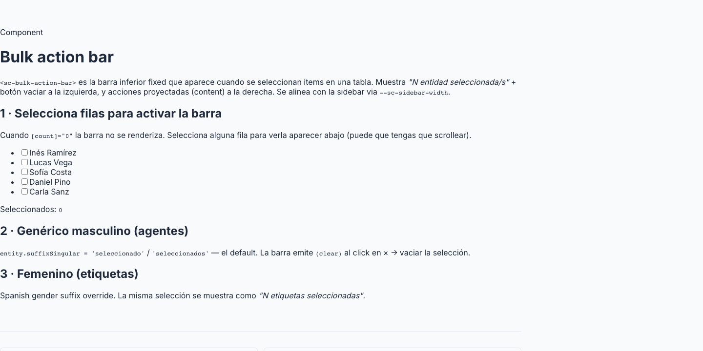

# 23 · Bulk Action Bar (`<sc-bulk-action-bar>`)



> **Type**: Pure SC · **AED uses**: 6 · **Figma parity**: Sin Figma equivalente

> Barra inferior fija que aparece cuando hay items seleccionados en una list page. Muestra el conteo + clear button a la izquierda, y un slot de acciones proyectadas a la derecha (Eliminar, Editar bulk, Exportar...). Memoria: **overlay, no push** — no causa CLS sobre la tabla.
>
> Categoría ⚪ **Pure SC** — pattern industria (Gmail, Linear, Notion). Versión SC alineada con el sidebar fijo (`--sc-sidebar-width` offset).

## TL;DR

```html
<sc-bulk-action-bar
  [count]="selectedIds().size"
  [entity]="{ singular: 'usuario', plural: 'usuarios' }"
  (clear)="clearSelection()"
>
  <button type="button" class="btn btn--secondary" (click)="exportSelected()">
    <lucide-icon [img]="downloadIcon" [size]="14" />
    Exportar
  </button>
  <button type="button" class="btn btn--danger" (click)="requestBulkDelete()">
    <lucide-icon [img]="trashIcon" [size]="14" />
    Eliminar
  </button>
</sc-bulk-action-bar>
```

Renderizada solo cuando `count > 0`. El parent ya gestiona la selección.

## Cuándo usarlo

- List pages donde el usuario puede seleccionar múltiples filas (checkbox column).
- Operaciones bulk: delete, edit, export, archive, transfer.
- Memoria `feedback_no_layout_shift`: bar overlay (no empuja contenido) — la tabla mantiene su altura, evita CLS.

## Cuándo NO usarlo

- Single-row actions → row hover actions (botones inline en la celda).
- Selección que NO va a recibir bulk operations → no mostrar la bar (count = 0 oculta).
- Modal / drawer con selección — el modal tiene su propio footer.

## Anatomía

```
══════════════════════════════════════════════════════════════
  ✕  3 usuarios seleccionados            [Exportar] [Eliminar]
══════════════════════════════════════════════════════════════
  ↑                                              ↑
 clear button                              actions slot
```

Fixed bottom, full-width minus sidebar. Bg primary tinted. Shadow up. Slide-in animation.

## API

```typescript
interface BulkActionEntityLabels {
  singular: string;                // "usuario"
  plural: string;                  // "usuarios"
  suffixSingular?: string;         // default "seleccionado" (masculine)
  suffixPlural?: string;           // default "seleccionados"
}

interface ScBulkActionBarProps {
  count: number;                   // requerido — selected items count
  entity: BulkActionEntityLabels;  // requerido — for the summary text
}

// Output
(clear): EventEmitter<void>;       // user clicked ✕ → caller debe limpiar selection
```

El componente NO contiene actions. El parent las proyecta como children — máxima flexibilidad por feature.

## Summary text

Auto-generated: `"{count} {entity-label} {suffix}"`.

Ejemplos:
- `1 usuario seleccionado`
- `5 usuarios seleccionados`
- `1 agenda seleccionada` (parent pasa `suffixSingular: 'seleccionada'` para feminine)

## Tokens consumidos

| Token | Uso |
|-------|-----|
| `--sc-bg-primary-subtle` | bar background |
| `--sc-border-primary-subtle` | top border |
| `--sc-text-primary` | summary text |
| `--sc-shadow-popover` | sombra hacia arriba |
| `--sc-sidebar-width` | left offset (alinea con main column) |
| `--sc-spacing-1-125/400` | paddings |
| `--sc-z-overlay` | z-index sobre tabla |
| Slide-in transition | 200ms ease-out |

## Decisiones de diseño SC

- **Overlay, no push** (memoria `feedback_no_layout_shift`): la bar tiene `position: fixed` bottom, no participa en flujo. Mostrar/ocultar NO desplaza la tabla — evita CLS y la sensación de "la página se mueve solo".
- **Sidebar-aware**: el `left: var(--sc-sidebar-width)` la alinea con la columna principal (no debajo del sidebar). Asume el sidebar es fijo a la izquierda — pattern AED.
- **Bar SIN actions internas**: el componente solo render summary + clear. Las actions son slot. Razón: cada feature define sus propias acciones (users tiene "Cambiar tipo", agents tiene "Transferir grupo", etc.) — meter eso dentro complicaría la API.
- **Feminine support via suffix override**: español necesita "seleccionada" para "agenda", "seleccionado" para "usuario". Default masculine, override per-entity.
- **Auto-hide cuando count = 0**: el computed `visible()` controla el render. No exige al parent que muestre/oculte manualmente.

## A11y

- `role="region"` con `aria-label` describing the bulk action context.
- Summary text es leído como part de la region.
- Clear button con `aria-label="Quitar selección"` (i18n).
- Cuando la bar aparece (count cambia de 0 a 1), el screen reader anuncia el cambio via `aria-live` polite.

## Uso en AED

**6 instancias** (todas las list pages con selección):
- `/admin/usuarios`, `/admin/grupos`, `/admin/agentes`.
- `/admin/etiquetas`, `/admin/plantillas`.
- `/admin/agendas` (y los otros repos: horarios, motivos, etc. — todos comparten el patrón via `<sc-repo-list-page>`).

Pareada típicamente con `<sc-delete-entity-dialog mode="bulk">` y `<sc-bulk-edit-menu>` en la actions slot.

## Página demo

Pendiente — gallery `/components/bulk-action-bar` con:
- Basic con 1/N items.
- Feminine vs masculine suffix.
- Múltiples actions en slot.
- Dark mode.
- Sidebar variants (none, narrow, wide).

## Figma reference

**No aplica** — pattern in-house. Visual inspiración Gmail / Linear. Si el equipo de diseño lo modela, anotar URL.
