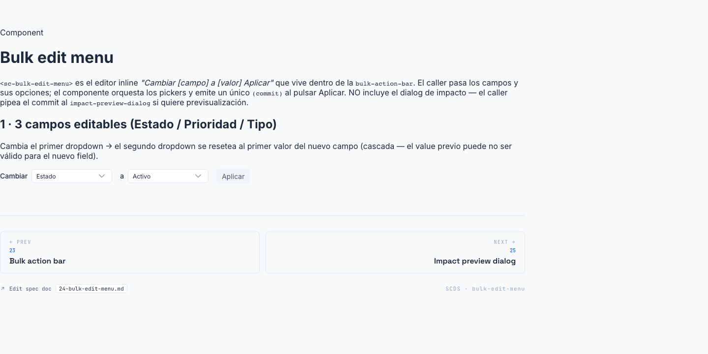

# 24 · Bulk Edit Menu (`<sc-bulk-edit-menu>`)



> **Type**: Pure SC · **AED uses**: 2 · **Figma parity**: Sin Figma equivalente

> Editor inline "Cambiar [field] a [value] [Aplicar]" que vive dentro de la `<sc-bulk-action-bar>`. Caller pasa los campos editables y sus value choices; este componente orquesta los pickers y emite un `commit` único cuando el usuario clica Aplicar. La mutación efectiva suele pasar por `<sc-impact-preview-dialog>` antes de persistir.
>
> Categoría ⚪ **Pure SC** — pattern propio.

## TL;DR

```html
<sc-bulk-action-bar [count]="selectedIds().size" [entity]="entityLabels()" (clear)="clearSelection()">
  <sc-bulk-edit-menu [fields]="bulkEditFields()" (commit)="onBulkEditCommit($event)" />
  <button type="button" class="btn btn--danger" (click)="requestBulkDelete()">Eliminar</button>
</sc-bulk-action-bar>
```

```typescript
// Parent maneja el commit + preview impact
onBulkEditCommit(c: BulkEditCommit): void {
  this.impactPreview.set({
    field: c.fieldLabel,
    currentLabel: '...',
    newLabel: c.valueLabel,
    items: this.selectedItems(),
  });
}
```

## Cuándo usarlo

- List pages donde quieres permitir editar 1 campo a N rows en bloque.
- Slot izquierdo / centro de `<sc-bulk-action-bar>`.
- Casos típicos: cambiar status (active→inactive en bulk), cambiar tier, asignar grupo, asignar tag.

## Cuándo NO usarlo

- Edición de un solo registro → inline editing en la fila (`<sc-inline-rename-cell>` para name).
- Multi-field edition simultánea → no este componente; abrir modal con form completo.
- Bulk delete → solo `<sc-bulk-action-bar>` + button + `<sc-delete-entity-dialog mode="bulk">` (no necesita field picker).

## Anatomía

```
┌─────────────────────────────────────────────────────────┐
│  Cambiar [▾ Field    ] a [▾ Value    ]    [Aplicar]    │
└─────────────────────────────────────────────────────────┘
```

Dos selects inline + botón Aplicar. El segundo select se rellena en base al primer field elegido.

## API

```typescript
interface BulkEditFieldOption {
  key: string;                                  // stable id pasado de vuelta al caller
  label: string;                                // texto visible en el field selector
  values: readonly BulkEditValueOption[];       // choices para este field; values[0] = default
}

interface BulkEditValueOption {
  value: string;
  label: string;
}

interface BulkEditCommit {
  fieldKey: string;
  fieldLabel: string;
  value: string;
  valueLabel: string;
}

interface ScBulkEditMenuProps {
  fields: readonly BulkEditFieldOption[];       // requerido
  buttonLabel?: string;                         // legacy: default "Editar" (kept for source compat, no longer rendered)
}

// Output
(commit): EventEmitter<BulkEditCommit>;
```

## Tokens consumidos

| Token | Uso |
|-------|-----|
| `--sc-bg-surface` | menu background dentro de la bar |
| `--sc-border-default` | borders de los selects |
| `--sc-bg-primary` | Aplicar button |
| `--sc-spacing-100/200` | gaps + paddings |
| Select height | matches `sc-select` size sm |
| Chevron icon | 14px (lucide ChevronDown) |

## Decisiones de diseño SC

- **Cascade reset**: cambiar field → resetea value al primer valid de ese field. Razón: el value previo puede no existir en el nuevo field domain. Si te quedas con el valor old, podrías commitir algo inconsistente.
- **Effect inicial**: el constructor effect asegura que `selectedFieldKey` y `selectedValue` tienen valores válidos al primer paint (fields[0] + values[0]). Sin esto, el primer click "Aplicar" antes de tocar los selects fallaría silenciosamente.
- **`commit` no muta el state interno**: el menú no cambia su selection tras emitir. El parent puede mantener el menú abierto para próximas operaciones bulk con el mismo field.
- **Native `<select>` inside (no `<sc-select>`)**: este componente vive dentro de una bar densa — el chrome del `<sc-select>` (label, helper text slots) sería overkill. Native selects mantienen footprint mínimo.
- **`buttonLabel` legacy**: input mantenido por source compat — el botón Aplicar usa texto fijo ahora. Próxima clean-up cuando confirmemos que nadie lo pasa.

## A11y

- Cada `<select>` tiene `aria-label` describing what it controls ("Campo a cambiar", "Nuevo valor").
- Apply button con texto visible.
- Tab navega entre selects + button.
- Disabled state cuando `!canApply()` (no value valid o field no elegido).

## Uso en AED

**2 instancias**:
- `users-list-page` bulk bar: cambiar type, cambiar status.
- `agents-list-page` bulk bar: cambiar type, asignar grupo (futuro).

Otras list pages aún sin bulk edit (CRUD repos básicos).

## Página demo

Pendiente — gallery `/components/bulk-edit-menu` con:
- 1 field, varios values.
- N fields, varios values cada uno (cascade reset demo).
- Estado disabled.
- Dark mode.

## Figma reference

**No aplica** — pattern in-house. Vive dentro del slot de `<sc-bulk-action-bar>`. Si el equipo de diseño modela bar+menu como un solo Figma component, anotar URL.
