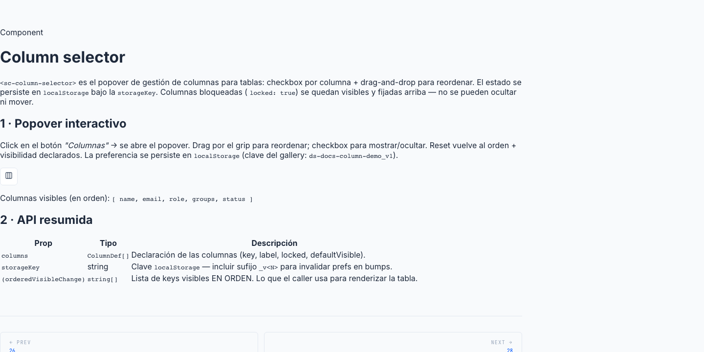

# 27 · Column Selector (`<sc-column-selector>`)



> **Type**: Pure SC · **AED uses**: 3 · **Figma parity**: Sin Figma equivalente

> Popover trigger desde una list page para configurar **qué columnas son visibles** y en **qué orden**. Soporta visibilidad por checkbox + drag-drop para reordenar. Persiste preferencias en `localStorage` con versionado. Columnas marcadas `locked` se quedan fijas y no se pueden mover ni ocultar.
>
> Categoría ⚪ **Pure SC** — pattern in-house, similar a column manager de Linear / Notion.

## TL;DR

```html
<sc-column-selector
  [columns]="USER_COLUMNS"
  storageKey="users.columns_v3"
  buttonLabel="Columnas"
  (orderedVisibleChange)="onColumnsChange($event)"
/>
```

```typescript
const USER_COLUMNS: readonly ColumnDef[] = [
  { key: 'name', label: 'Nombre', locked: true },
  { key: 'email', label: 'Email' },
  { key: 'type', label: 'Tipo' },
  { key: 'status', label: 'Estado', defaultVisible: false },
];

protected onColumnsChange(visible: readonly string[]): void {
  this.visibleColumns.set(visible);
}
```

## Cuándo usarlo

- List page con muchas columnas donde el usuario quiere controlar qué ve.
- Necesitas que la preferencia persista entre sesiones (`localStorage`).
- La columna principal ("Nombre") debe ser inmovible y siempre visible — usar `locked: true`.

## Cuándo NO usarlo

- Tabla con pocas columnas (<4) — no aporta valor.
- Columnas que cambian dinámicamente per-row — el selector espera una lista declarada estática.
- Selección de filas (no columnas) → `<sc-bulk-action-bar>`.

## Anatomía

```
┌──────────────────────┐
│ [⊞ Columnas]   ▾    │   ← trigger (popover anchor)
└──────────────────────┘
        │
        ▼
┌────────────────────────────────────┐
│ [🔒] Nombre                        │  ← locked (no checkbox, no grip)
├────────────────────────────────────┤
│ [≡] [✓] Email                      │  ← grip + checkbox + label
│ [≡] [✓] Tipo                       │
│ [≡] [ ] Estado                     │  ← unchecked = hidden
│                                    │
│              [↻ Restaurar default] │  ← reset button
└────────────────────────────────────┘
```

Popover with rows: lock icon | grip icon | checkbox | label. Drag-drop para reordenar (no permite mover por encima de un locked).

## API

```typescript
interface ColumnDef {
  key: string;                // stable id persisted en localStorage
  label: string;              // texto visible en el popover
  locked?: boolean;           // default false — locked = visible + fixed
  defaultVisible?: boolean;   // default true — false = hidden on first paint
}

interface ScColumnSelectorProps {
  columns: readonly ColumnDef[];          // requerido
  storageKey: string;                     // requerido — incluir suffix `_v<N>` para invalidar cache
  buttonLabel?: string;                   // default 'Columnas' (aria-label override)
}

// Outputs
type OrderedVisible = readonly string[];
(orderedVisibleChange): EventEmitter<OrderedVisible>;
(visibilityChange): EventEmitter<ReadonlySet<string>>;  // legacy Set-based
```

## Persistencia

State persistido en `localStorage[storageKey]` como JSON array de keys visibles en orden.

**Convention**: `storageKey` debería incluir un sufijo `_v<N>` (e.g. `'users.columns_v3'`). Cuando los devs cambian materialmente la lista de columnas (orden default, nueva columna importante), bumpear el sufijo invalida la cache del usuario sin tocar localStorage manualmente.

Lectura tolerante:
- `localStorage` no disponible → fallback a `defaultOrdered`.
- JSON parse error → fallback.
- Keys persisted que ya no existen en `columns()` → filtradas.
- Keys nuevas (declared después de persistir) → appended honoring `defaultVisible`.

## Tokens consumidos

| Token | Uso |
|-------|-----|
| `--sc-bg-surface` | popover background |
| `--sc-bg-secondary-subtle` | row hover |
| `--sc-border-default` | popover border |
| `--sc-shadow-popover` | popover elevation |
| `--sc-text-primary` | label |
| `--sc-icon-subtle` | grip + lock icons |
| `--sc-spacing-100/200` | gaps + paddings |
| Row height | ~32px |
| Grip + lock icon size | 14px |

## Decisiones de diseño SC

- **Hydration fallback en `isVisible`**: hasta que el effect del constructor lea `localStorage` y emita, `ordered()` está vacío. Sin fallback, los checkboxes pintarían UNCHECKED en primer paint — engañoso porque la tabla SÍ pinta las columnas defaultVisible. Mirror la regla `defaultVisible !== false = visible` en el `isVisible()` getter para coincidir con lo que la tabla muestra.
- **`commit()` siempre re-emite via `isVisible`**: `toggle()` y `onDrop()` resuelven el conjunto visible via `isVisible()` (no via `ordered()` directo). Esto preserva el fallback hydration durante el primer toggle/drag. Sin esto, el primer toggle ANTES de hidratación trataría todas las keys como "not visible" → commitearía una lista vacía → tabla pierde todas las columnas.
- **Locked = visible + fixed**: la columna "Nombre" suele ser locked. Sin checkbox para ocultar, sin grip para mover. CSS posiciona el lock icon en la misma columna que el grip pero diferente glyph.
- **Drag respeta locks**: el `onDrop()` rechaza drops si el target está locked (no se puede mover ABAJO de un locked sin moverlo, que no es permitido). Conserva el orden de los locked en top.
- **Dual output `orderedVisibleChange` + `visibilityChange`**: el output canónico es `orderedVisibleChange` (lleva ORDEN). Mantenemos `visibilityChange` (Set, no orden) por source compat con list pages legacy que no han migrado al render data-driven. Nuevos consumers deben bindear `orderedVisibleChange`.

## A11y

- Trigger button con `aria-label` (sobrescribible via `buttonLabel`).
- PopoverModule de PrimeNG con `role="dialog"`.
- Checkboxes nativos con `<label>` asociado.
- Grip icon decorativo (`aria-hidden="true"`); drag handle es el row container con `cdkDrag` (keyboard support de CDK).
- Lock icon decorativo + label "(bloqueada)" anunciado por lectores.
- Reset button con `aria-label="Restaurar columnas por defecto"`.

## Uso en AED

**3 instancias**:
- `users-list-page` (storageKey `users.columns_v3`).
- `agents-list-page` (storageKey `agents.columns_v2`).
- `groups-list-page` (storageKey `groups.columns_v2`).

Otras list pages (CRUD repos básicos) usan tabla fija sin column selector — el patrón solo aplica cuando hay 4+ columnas y configurabilidad real.

## Página demo

Pendiente — gallery `/components/column-selector` con:
- Basic con 5 columnas (1 locked, 4 togglable).
- Drag-drop demo.
- Reset to default.
- Persistencia entre reloads (storybook hack o localStorage clear button).
- Dark mode.

## Figma reference

**No aplica** — pattern in-house. Visual inspiración Linear column settings / Notion view config.
