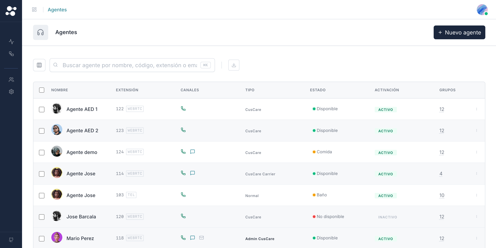

# 28 · Inline Rename Cell (`<sc-inline-rename-cell>`)



> **Type**: Pure SC · **AED uses**: 3 · **Figma parity**: Sin Figma equivalente

> Celda editable in-place que reemplaza el name de una row recién duplicada. Sin router round-trip ni modal — el usuario sigue en la lista y renombra el draft directo. La row mantiene su posición (no shift) y la celda mantiene su ancho (los buttons colapsan a icon-only).
>
> Categoría ⚪ **Pure SC** — adaptación del React prototype's `InlineDuplicateRow`.

## TL;DR

```html
@if (renamingId() === row.id) {
  <sc-inline-rename-cell
    [initialValue]="row.name"
    [placeholder]="'common.name_placeholder' | translate"
    [ariaLabel]="'Renombrar duplicado'"
    (commit)="onRenameCommit(row.id, $event)"
    (cancelled)="onRenameCancel(row.id)"
  />
} @else {
  {{ row.name }}
}
```

## Cuándo usarlo

- Post-duplicate inline: el usuario clica "Duplicar" en una row → el draft entra a la tabla → la celda name pasa a editable hasta que confirme o cancele.
- Cualquier flow donde queremos rename rápido SIN sacar al usuario de la tabla.

## Cuándo NO usarlo

- Crear desde cero → form completo, no inline cell.
- Edit completo de la entidad → router push a la edit page con `<sc-sticky-form-header>`.
- Bulk rename → no soportado (no tendría sentido inline).

## Anatomía

```
┌────────────────────────────────────────────┐
│  [_____ rename input ____]  ✓  ✗           │
└────────────────────────────────────────────┘
       ↑                       ↑   ↑
    autofocus+select        commit  cancel
```

Input transparente sin border, mismo font + line-height que la celda resting (matches sin shift). Iconos Check + X inline a la derecha.

## API

```typescript
interface ScInlineRenameCellProps {
  initialValue: string;            // requerido — name actual de la row
  placeholder?: string;            // default ''
  ariaLabel?: string;              // default 'Renombrar'
}

// Outputs
(commit): EventEmitter<string>;    // value trimmed; caller persiste el rename
(cancelled): EventEmitter<void>;   // caller decide: borrar el draft o revertir el name
```

## Comportamiento

- **Autofocus + select-all** on mount (Fitts: el usuario YA está en "rename mode", no debe tener que click + select manualmente).
- **Enter** o **✓ button** → emit `commit` con value trimmed (si vacío, no emite — comportamiento defensivo).
- **Escape** o **✗ button** → emit `cancelled`.
- **Empty / whitespace-only** → commit disabled (button + Enter no emiten).
- Width matchea la celda resting → la tabla NO se reflowa al entrar/salir de modo rename.

## Tokens consumidos

| Token | Uso |
|-------|-----|
| Input border | transparent (matches cell resting) |
| Input bg | transparent |
| Input font-size | inherit from cell |
| `--sc-icon-subtle` | check + close icons |
| `--sc-bg-success-subtle` | check button hover |
| `--sc-bg-secondary-hover` | close button hover |
| `--sc-spacing-0-25` | gap input ↔ buttons |
| Icon size | 14px |

## Decisiones de diseño SC

- **`queueMicrotask` en `ngAfterViewInit`**: el `el.focus()` + `el.select()` debe ejecutarse tras el primer paint para garantizar que el `<input>` está montado y attached al DOM. Sin queueMicrotask, race conditions con OnPush + ChangeDetection pueden dejar el focus sin aplicarse en navegadores que detachan elementos. Pattern conocido.
- **`commit` exige value no-vacío**: el caller no debería recibir "" como rename — semántica de "renombrar a nada" no aplica. El template también disabled el ✓ button cuando empty.
- **NO doble-emit en Enter+blur**: Enter dispara `commit` directamente. El blur del input NO dispara commit (deliberado — el blur podría ser por click en X o fuera, mejor dejarlo al cancel explícito).
- **Input transparent borderless**: matches el resting visual de la celda. Si pusiéramos border + bg, la tabla "salta" visualmente al entrar a rename. Mantener flat preserva la sensación de continuidad.

## A11y

- `<input>` con `aria-label` traducible (sobrescribible).
- Check button con `aria-label="Confirmar"`.
- Close button con `aria-label="Cancelar"`.
- Teclado: Enter commits, Escape cancels (estándar).

## Uso en AED

**3 instancias** (list pages con duplicate inline):
- `users-list-page`: tras duplicate user, name editable in place.
- `agents-list-page`: idem.
- `groups-list-page`: idem.

Otras list pages (CRUD repos) no exponen duplicate-then-rename inline — el flujo es "Nueva entrada" via panel form.

## Página demo

Pendiente — gallery `/components/inline-rename-cell` con:
- Basic con value inicial.
- Empty placeholder.
- Cancel comportamiento.
- Commit comportamiento + trimmed.
- Side-by-side con cell resting para mostrar no-shift.
- Dark mode.

## Figma reference

**No aplica** — pattern in-house. Visual minimalista (input transparente + 2 icon buttons). Si el equipo de diseño lo modela, anotar.
