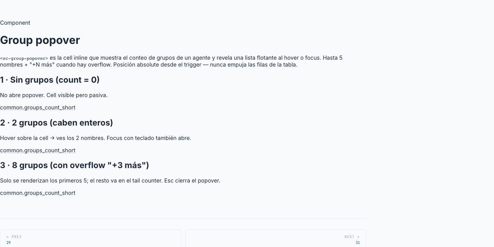

# 30 · Group Popover (`<sc-group-popover>`)



> **Type**: Pure SC · **AED uses**: 1 · **Figma parity**: Sin Figma equivalente

> Celda inline que muestra el conteo de grupos asociados a un agente y revela un mini-panel flotante con la lista al hover/focus. Lista hasta 5 nombres + "+N más" en la cola si hay overflow. Floats sobre la tabla con `position: absolute` — abrir el panel NO empuja las rows (no CLS).
>
> Categoría ⚪ **Pure SC** — pattern in-house para list cells densas con N relaciones que no caben inline.

## TL;DR

```html
<!-- En una table cell de la list de agentes -->
<sc-group-popover [groups]="agent.groups" />
```

```typescript
// agent.groups: readonly GroupRef[]
interface GroupRef { id: number; name: string; }
```

## Cuándo usarlo

- List cell donde una entidad tiene N relaciones (grupos asignados, etiquetas, roles) y quieres mostrar el conteo + detalle on-demand.
- Cuando el promedio de N es alto (3-15) y mostrar inline rompería la grid.
- Floats sobre la table (DD#8) — el panel NO debe participar en row flow.

## Cuándo NO usarlo

- Pocas relaciones (1-2) → mostrar inline directo.
- Edición de la asignación → no es el lugar; usar form / dialog completo.
- Mobile (touch) → hover no aplica; usar bottom sheet o navegación a detail.

## Anatomía

```
┌──────────────────┐
│ Diseño · 3 grupos │    ← cell resting: count
└──────────────────┘
         │
         ▼ (hover / focus)
   ┌────────────────────────┐
   │ Ventas Nacional        │
   │ Cobros                 │
   │ VIP                    │
   │ +5 más                 │  ← tail si count > 5
   └────────────────────────┘
```

## API

```typescript
interface GroupRef {
  id: number;
  name: string;
}

interface ScGroupPopoverProps {
  groups: readonly GroupRef[];  // requerido
}
```

Sin outputs. Component view-only.

## Constantes internas

| Constante | Valor | Uso |
|---|---|---|
| `VISIBLE_LIMIT` | 5 | Máximo de grupos en el panel antes de "+N más" |
| `HOVER_LEAVE_DELAY_MS` | 150 | Delay anti-flicker mouse trigger ↔ panel |

## Tokens consumidos

| Token | Uso |
|-------|-----|
| `--sc-bg-surface` | panel background |
| `--sc-border-default` | panel border |
| `--sc-shadow-popover` | panel elevation |
| `--sc-text-primary` | nombres + count |
| `--sc-text-secondary` | "+N más" |
| `--sc-spacing-100/200` | gaps + paddings |
| Panel position | absolute, top + left calculated del trigger |
| Z-index | popover layer |

## Decisiones de diseño SC

- **`position: absolute` (no fixed, no `top-layer`)**: el panel se posiciona relativo al cell, no a la viewport. Eso lo hace responsivo al scroll de la tabla y simplifica el cálculo del anchor.
- **Floats sobre row, no push (DD#8)**: el panel está fuera del flujo de la tabla — abrir no incrementa la altura de la row. Si añadieran el panel como `display: block` debajo del nombre, la row crecería en hover y empujaría las siguientes (CLS y mareo).
- **Hover + focus, no solo hover**: la accesibilidad obliga a soportar keyboard. Tab al cell → focus → panel se abre. Mismo behavior visual que hover.
- **Hover-leave delay (150ms)**: el usuario suele mover el ratón en diagonal del trigger al panel. Sin delay, hover-leave del trigger antes de llegar al panel cierra el panel. 150ms es estándar para tooltips/popovers (matches React Tippy.js default).
- **"+N más" simple, no clickable**: no abre lista expandida ni navega — solo informa. Si el usuario quiere ver TODOS, va al detail del agente. Mantenemos el popover bounded.
- **No interactivo en el panel**: los nombres son texto, no links. El panel es read-only inline. Editar asignaciones es scope del agent-form-page.
- **Escape close**: con focus en el trigger, pulsar Escape cierra el panel.

## A11y

- `<button>` real como trigger (recibe focus nativo, keyboard navega).
- `aria-expanded` refleja `open()`.
- `aria-haspopup="true"`.
- Panel con `role="tooltip"` (informational, no interactive).
- Escape cierra cuando focused.

## Uso en AED

**1 instancia**:
- `agents-list-page` columna "Grupos" — cada cell pinta `<sc-group-popover [groups]="agent.assignedGroupRefs">`.

## Página demo

Pendiente — gallery `/components/group-popover` con:
- 0 groups (nada visible).
- 1-5 groups (sin "+N más").
- 6+ groups (con "+N más").
- Hover delay demo.
- Keyboard focus demo.
- Dark mode.

## Figma reference

**No aplica** — pattern in-house. Si el equipo de diseño lo modela como un mini-tooltip, anotar.
