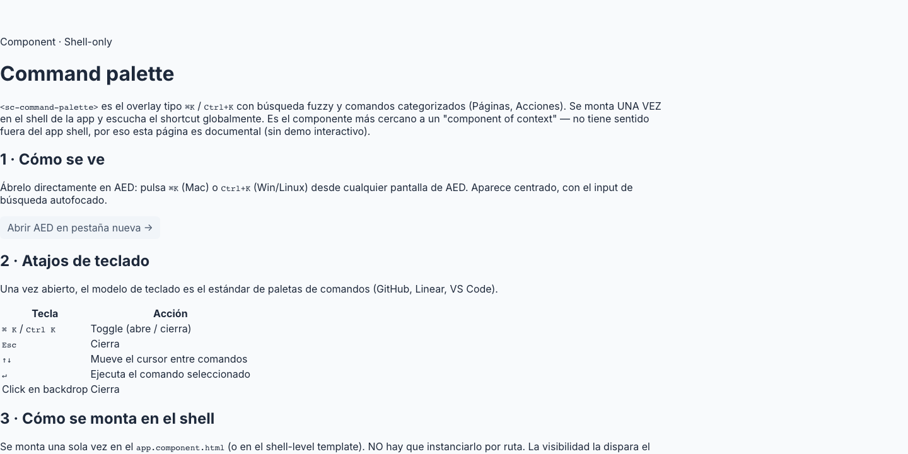

# 31 · Command Palette (`<sc-command-palette>`)



> **Type**: Pure SC · **AED uses**: 1 · **Figma parity**: Sin Figma equivalente

> Overlay ⌘K / Ctrl+K — paleta de comandos searchable global. Mounted una vez en el app shell, escucha el shortcut, y renderiza la lista de comandos categorizados desde `CommandPaletteService`. Navegación con flechas, Enter ejecuta, Esc cierra.
>
> Categoría ⚪ **Pure SC** — pattern industry (Linear, Notion, Raycast). NO existe en PrimeNG.

## TL;DR

```html
<!-- En app.component.html, una sola vez -->
<sc-command-palette />
```

```typescript
// En cualquier feature, registrar comandos:
this.paletteService.register({
  id: 'create-agent',
  category: 'Acciones',
  label: 'Crear agente',
  keywords: ['nuevo', 'agente', 'add'],
  action: () => this.router.navigate(['/admin/agentes/nuevo']),
});
```

## Cuándo usarlo

- Acciones rápidas accesibles desde cualquier ruta de la app.
- Navegación rápida sin tocar el ratón.
- Search-driven UX para power users (supervisores que conocen los nombres).

## Cuándo NO usarlo

- Form-specific actions → estos van en el form mismo, no en la paleta global.
- Acciones contextuales a una row → row hover actions inline.
- Wizard / flow guiado → no es el lugar.

## Keyboard model

| Key | Acción |
|---|---|
| ⌘ K / Ctrl K | Toggle open/close |
| Esc | Close |
| ↑ / ↓ | Move highlighted command |
| Enter | Run highlighted command |
| Click backdrop | Close |
| Click command | Run + close |

## Anatomía

```
┌────────────────────────────────────────────────┐
│  🔍 [_____________ search ___________________] │  ← input (autofocus on open)
├────────────────────────────────────────────────┤
│  ACCIONES                                      │  ← category header (uppercase)
│   [icon]  Crear agente                         │  ← cmd row (highlighted)
│   [icon]  Crear grupo                          │
│  NAVEGACIÓN                                    │
│   [icon]  Ir a usuarios                        │
│   [icon]  Ir a etiquetas                       │
└────────────────────────────────────────────────┘
       ↑
   Backdrop fixed
```

## API

```typescript
interface PaletteCommand {
  id: string;
  category: 'Acciones' | 'Navegación' | string;
  label: string;
  keywords?: readonly string[];   // bonus search terms
  icon?: string;                  // key into NAV_ICONS map
  action: () => void;             // ejecutado on Enter / click
}

// CommandPaletteService API
interface CommandPaletteService {
  visible: Signal<boolean>;
  commands: Signal<readonly PaletteCommand[]>;
  register(cmd: PaletteCommand): void;
  unregister(id: string): void;
  open(): void;
  close(): void;
  toggle(): void;
}
```

El componente NO tiene `@Input`s — toda la state vive en `CommandPaletteService`.

## Search

- Match por **label** (case-insensitive contains).
- Match por **keywords** (mismo criterio).
- Sin fuzzy matching (TODO si aparece caso).

## Tokens consumidos

| Token | Uso |
|-------|-----|
| `--sc-bg-surface` | dialog background |
| `--sc-bg-overlay-strong` | backdrop |
| `--sc-bg-secondary-subtle` | highlighted row |
| `--sc-border-subtle` | dividers |
| `--sc-shadow-popover-lg` | dialog elevation |
| `--sc-text-primary` | label |
| `--sc-text-secondary` | category headers |
| `--sc-radius-300` | dialog corners |
| `--sc-spacing-200/300/400` | paddings + gaps |
| Z-index | top-most overlay |

## Decisiones de diseño SC

- **Service-driven, no parent state**: la visibility y comandos viven en `CommandPaletteService`. El componente solo render. Esto permite registrar comandos desde CUALQUIER feature lazy-loaded sin que el shell tenga que conocerlos.
- **`@HostListener('document:keydown')`**: el ⌘K se escucha globalmente sin importar dónde está focus. Otros keys (Esc, arrows, Enter) solo cuando `visible()` (no roban shortcuts del resto de la app cuando cerrado).
- **Reset on open**: cada vez que abre, `query = ''` + `highlighted = 0` + focus al search input. Razón: si dejaste un query previo y reabres, esperarías comenzar desde cero. Idéntico al patrón Raycast / Spotlight.
- **Aritmética modular en `move()`**: `(i + delta + len) % len` permite wrap-around tanto ↑ como ↓. El `+ len` antes del `%` previene resultados negativos en JS (operator `%` no es módulo matemático, es remainder).
- **Highlight on hover**: además de keyboard, mouse hover sincroniza el highlighted index. Si el usuario navega con flechas, luego mueve ratón, el highlight follows.

## A11y

- Dialog con `role="dialog"` + `aria-modal="true"`.
- Search input con `aria-label="Buscar comandos"`.
- Lista con `role="listbox"`.
- Cada cmd row con `role="option"` + `aria-selected`.
- Focus trap inside dialog (heredado del overlay pattern).
- Lectores anuncian categoría + label al cambiar highlighted.

## Uso en AED

**1 instancia** (singleton):
- `app.component.html` — mounted una vez global.

Comandos registrados desde:
- `app.component.ts` (navegación principal).
- Feature lazy-loaded modules cuando aplique (futuro).

## Página demo

Pendiente — gallery `/components/command-palette` con:
- Empty state (sin query).
- Con query (filtered).
- Sin matches (empty filter state).
- Keyboard navigation demo.
- Dark mode.

## Figma reference

**No aplica** — pattern in-house. Visual inspiración: Linear command palette, macOS Spotlight, VSCode Command Palette.
