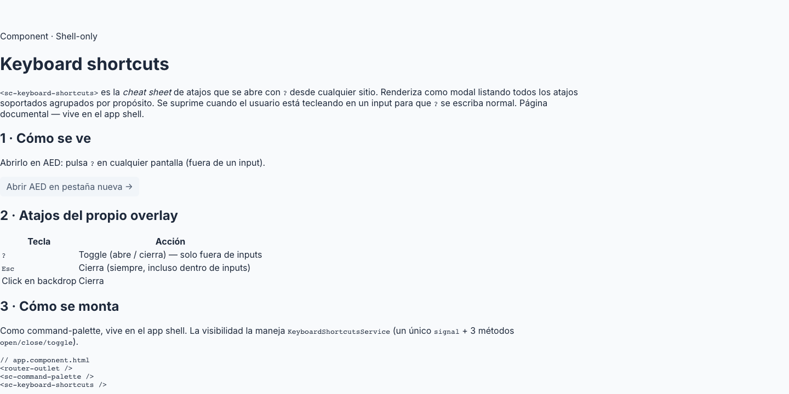

# 32 · Keyboard Shortcuts (`<sc-keyboard-shortcuts>`)



> **Type**: Pure SC · **AED uses**: 1 · **Figma parity**: Sin Figma equivalente

> Cheat sheet de atajos de teclado, triggereado por `?` desde cualquier parte de la app. Modal-like overlay que lista todos los shortcuts soportados agrupados por propósito. Suprimido cuando el usuario está escribiendo en input/textarea/select — así pulsar `?` dentro de un form-field tipea el caracter en vez de abrir la ayuda.
>
> Categoría ⚪ **Pure SC** — pattern industria (Linear, Notion, Gmail). Owns su propio visibility signal.

## TL;DR

```html
<!-- En app.component.html, una sola vez -->
<sc-keyboard-shortcuts />
```

Sin props. El usuario presiona `?` desde cualquier lugar → se abre. Esc cierra.

## Cuándo usarlo

- App tiene >3 shortcuts no triviales que el usuario debe descubrir.
- Power users benefician de tener la lista accesible (sin docs externos).
- Onboarding ligero — el `?` shortcut es industry standard (Gmail desde 2005).

## Cuándo NO usarlo

- App con cero shortcuts → no aporta.
- Shortcuts trivialmente discoverables (botones con label) → la cheat sheet añade noise.

## Keyboard model

| Key | Acción |
|---|---|
| `?` | Open cheat sheet (suprimido en inputs) |
| Esc | Close (cuando open) |

## Anatomía

```
┌──────────────────────────────────────┐
│  Atajos de teclado            [✕]    │
├──────────────────────────────────────┤
│  NAVEGACIÓN                          │
│   ⌘ K            Paleta de comandos  │
│   Ctrl K         Paleta (Win/Linux)  │
│   ?              Mostrar atajos      │
│                                      │
│  EN LA PALETA                        │
│   ↑ ↓            Mover selección     │
│   ↵              Ejecutar            │
│   Esc            Cerrar              │
│                                      │
│  EN CUALQUIER PARTE                  │
│   Esc            Cerrar diálogo      │
│   ⌘ Z            Deshacer            │
└──────────────────────────────────────┘
```

Cada key como `<kbd>` chip. Grupos con header uppercase.

## API

Sin `@Input`s. Lista de shortcuts hardcoded en el componente — no es extensible runtime. Si una feature añade un shortcut, debe actualizar la lista del componente.

```typescript
// Estructura interna
interface ShortcutGroup {
  title: string;
  items: ReadonlyArray<{ label: string; keys: readonly string[] }>;
}
```

## State

- `visible` (Signal<boolean>) vive en `KeyboardShortcutsService` (singleton).
- El componente sub a ese signal y renderiza condicionalmente.

## Tokens consumidos

| Token | Uso |
|-------|-----|
| `--sc-bg-surface` | dialog bg |
| `--sc-bg-overlay-strong` | backdrop |
| `--sc-bg-secondary-subtle` | `<kbd>` chip bg |
| `--sc-border-subtle` | `<kbd>` chip border + dividers |
| `--sc-text-primary` | label |
| `--sc-text-secondary` | group title (uppercase) |
| `--sc-shadow-popover-lg` | dialog elevation |
| `--sc-radius-300` | corners |
| `--sc-spacing-200/300/400` | paddings |
| `<kbd>` typography | monospace, 11px |

## Decisiones de diseño SC

- **`isTypingTarget()` guard**: el `?` opens the cheat sheet — PERO si el usuario está escribiendo en un `<input>` / `<textarea>` / `<select>` o un contentEditable, el caracter `?` debe TIPEARSE, no abrir la ayuda. La función chequea `target.tagName` + `target.isContentEditable`. Sin esto, los usuarios no podrían escribir el caracter `?` en ningún campo.
- **Esc siempre handled (incluso typing)**: cuando el cheat sheet está abierto, Esc cierra prioritariamente. No respeta el typing guard — el user explicitly opened el dialog, espera que Esc lo dismisse.
- **Doble-check con command palette**: si la paleta de comandos ya está open, `?` no abre el cheat sheet (evita stacking de overlays competing).
- **Lista hardcoded**: a propósito. Los shortcuts son pocos y estables — un service registry runtime añadiría complejidad sin ganar.

## A11y

- Dialog con `role="dialog"` + `aria-modal="true"`.
- Título h2 + `<kbd>` elements para los key glyphs (semánticamente "keyboard input").
- Close button con `aria-label="Cerrar atajos"`.
- Esc dismiss.

## Uso en AED

**1 instancia** (singleton):
- `app.component.html` — mounted una vez global.

## Página demo

Pendiente — gallery `/components/keyboard-shortcuts` con:
- Open state.
- Multiple groups.
- Typing target suppression demo.
- Dark mode.

## Figma reference

**No aplica** — pattern in-house. Visual inspiración: GitHub `?` cheat sheet, Linear keyboard shortcuts.
